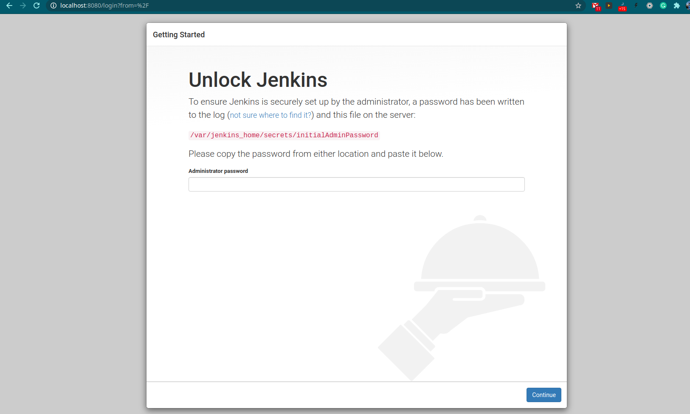
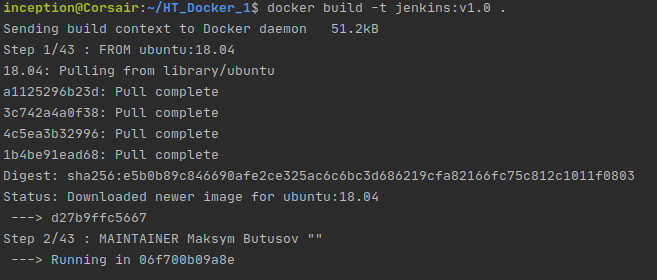
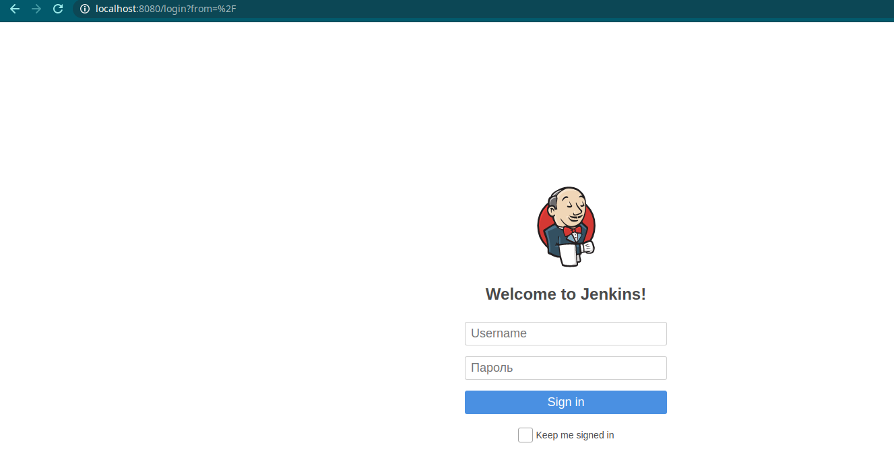

# Homework_Docker #1

### Tasks:
- Создать Dockerfile на основе чистого образа Ubuntu из https://hub.docker.com/ 
- Установить Jenkins внутрь контейнера 
- Предустановить нужные плагины 
- Сделать доступное описание в файле README.MD 
- Проект залить на https://github.com/ 
------------------------------------------------------------------------------------------
### Docker Hub Repository:
- https://hub.docker.com/r/incepti0n/jenkins

## Used resources
- Ubuntu 18.04
- Java openjdk version "1.8.0_252"
- Jenkins 2.235.2

## Solution
### Dockerfile v0.1

FROM ubuntu:18.04
MAINTAINER Maksym Butusov ""
RUN apt update -y && apt install wget git python3 gnupg2 unzip curl -y && \
    apt install openjdk-8-jdk -y && java -version && \
    wget -q -O - https://pkg.jenkins.io/debian-stable/jenkins.io.key | apt-key add - && \
    sh -c 'echo deb https://pkg.jenkins.io/debian-stable binary/ >/etc/apt/sources.list.d/jenkins.list' && \
    apt update -y && \
    echo "Import complete SUCSESSFULL" && \
    echo "Start to Install JEKINS" && \
    apt install jenkins -y && \
    echo "JEKINS has been Installed!!!"

EXPOSE 22
EXPOSE 80
EXPOSE 8080
EXPOSE 5000
VOLUME $JENKINS_HOME
ENTRYPOINT ["java", "-jar", "jenkins.war", "HTTP_PORT=80"]

###  docker build . -t jenkins:v0.1 

### docker run -it  -p 8080:8080 jenkins:v0.1

After this I had result like this:

## After that, I tried to make generate credentials and skip Jenkins setup wizard. (To tell the truth, it was too complicated).
### Dockerfile v1.0

FROM ubuntu:18.04
MAINTAINER Maksym Butusov ""
RUN apt update -y && apt install wget git python3 gnupg2 unzip curl -y && \
    apt install openjdk-8-jdk -y && java -version && \
    wget -q -O - https://pkg.jenkins.io/debian-stable/jenkins.io.key | apt-key add - && \
    sh -c 'echo deb https://pkg.jenkins.io/debian-stable binary/ >/etc/apt/sources.list.d/jenkins.list' && \
    apt update -y && \
    echo "Import complete SUCSESSFULL" && \
    echo "Start to Install JEKINS" && \
    apt install jenkins -y && \
    echo "JEKINS has been Installed!!!"
ARG user=jenkins
ARG group=jenkins
ARG uid=1000
ARG gid=1000
ARG http_port=8080
ARG agent_port=50000
ARG JENKINS_HOME=/var/jenkins_home
ARG REF=/usr/share/jenkins/ref

ENV JENKINS_HOME $JENKINS_HOME
ENV JENKINS_SLAVE_AGENT_PORT ${agent_port}
ENV REF $REF

#Jenkins is run with user `jenkins`, uid = 1000
#If you bind mount a volume from the host or a data container,
#ensure you use the same uid
RUN mkdir -p $JENKINS_HOME \
  && chown ${uid}:${gid} $JENKINS_HOME \
  && groupadd -g ${gid} ${group} \
  && useradd -d "$JENKINS_HOME" -u ${uid} -g ${gid} -m -s /bin/bash ${user} || echo "done"

#allows to skip Jenkins setup wizard
#ENV JAVA_OPTS -Djenkins.install.runSetupWizard=false

#Jenkins home directory is a volume, so configuration and build history
#can be persisted and survive image upgrades
VOLUME $JENKINS_HOME

#$REF (defaults to `/usr/share/jenkins/ref/`) contains all reference configuration we want
#to set on a fresh new installation. Use it to bundle additional plugins
#or config file with your custom jenkins Docker image.
RUN mkdir -p ${REF}/init.groovy.d

#Use tini as subreaper in Docker container to adopt zombie processes
ARG TINI_VERSION=v0.16.1
COPY tini_pub.gpg ${JENKINS_HOME}/tini_pub.gpg
RUN curl -fsSL https://github.com/krallin/tini/releases/download/${TINI_VERSION}/tini-static-amd64 -o /sbin/tini \
  && curl -fsSL https://github.com/krallin/tini/releases/download/${TINI_VERSION}/tini-static-amd64.asc -o /sbin/tini.asc \
  && gpg --no-tty --import ${JENKINS_HOME}/tini_pub.gpg \
  && gpg --verify /sbin/tini.asc \
  && rm -rf /sbin/tini.asc /root/.gnupg \
  && chmod +x /sbin/tini

#jenkins version being bundled in this docker image
ARG JENKINS_VERSION
ENV JENKINS_VERSION ${JENKINS_VERSION:-2.235.2}

#jenkins.war checksum, download will be validated using it
ARG JENKINS_SHA=97124ccfaf171e3703ca323e6b38310d1c11aa3a2357333f8f394ea7962b369b
#2d71b8f87c8417f9303a73d52901a59678ee6c0eefcf7325efed6035ff39372a
#SHA-256: 97124ccfaf171e3703ca323e6b38310d1c11aa3a2357333f8f394ea7962b369b

#Can be used to customize where jenkins.war get downloaded from
ARG JENKINS_URL=https://repo.jenkins-ci.org/public/org/jenkins-ci/main/jenkins-war/${JENKINS_VERSION}/jenkins-war-${JENKINS_VERSION}.war

#could use ADD but this one does not check Last-Modified header neither does it allow to control checksum
#see https://github.com/docker/docker/issues/8331
RUN curl -fsSL ${JENKINS_URL} -o /usr/share/jenkins/jenkins.war \
  && echo "${JENKINS_SHA}  /usr/share/jenkins/jenkins.war" | sha256sum -c -

ENV JENKINS_UC https://updates.jenkins.io
ENV JENKINS_UC_EXPERIMENTAL=https://updates.jenkins.io/experimental
RUN chown -R ${user} "$JENKINS_HOME" /usr/share/jenkins/ref

#for main web interface:
EXPOSE ${http_port}

#will be used by attached slave agents:
EXPOSE ${agent_port}

ENV COPY_REFERENCE_FILE_LOG $JENKINS_HOME/copy_reference_file.log

USER ${user}

COPY jenkins-support /usr/local/bin/jenkins-support
COPY jenkins.sh /usr/local/bin/jenkins.sh
COPY tini-shim.sh /bin/tini
ENTRYPOINT ["/sbin/tini", "--", "/usr/local/bin/jenkins.sh"]
USER root
COPY jenkins-support /usr/local/bin/jenkins-support
COPY install-plugins.sh /usr/local/bin/install-plugins.sh
COPY plugins.txt /usr/share/jenkins/ref/plugins.txt
RUN /usr/local/bin/install-plugins.sh < /usr/share/jenkins/ref/plugins.txt
#copy groovy scripd for create user and  disable initial setup
COPY basic-security.groovy ${JENKINS_HOME}/init.groovy.d/basic-security.groovy

## For create account I used script basic-security.groovy

#!groovy

import jenkins.model.*
import hudson.util.*;
import jenkins.install.*;
import hudson.security.*

def instance = Jenkins.getInstance()

def hudsonRealm = new HudsonPrivateSecurityRealm(false)

hudsonRealm.createAccount("admin","admin")
instance.setSecurityRealm(hudsonRealm)
instance.save()

instance.setInstallState(InstallState.INITIAL_SETUP_COMPLETED)

## All Scripts for auto-install plugins, such as install-plugins.sh jenkins.sh, jenkins-support.sh, etc., was taken from: https://github.com/jenkinsci/docker

## docker build -t jenkins:v1.0 .

## docker run -it  -p 8080:8080 jenkins:v1.0
## Result After runing the container 

Задание выполнено в полном объеме. Dockerfile написан корректно. Описание полное. Хорошая работа